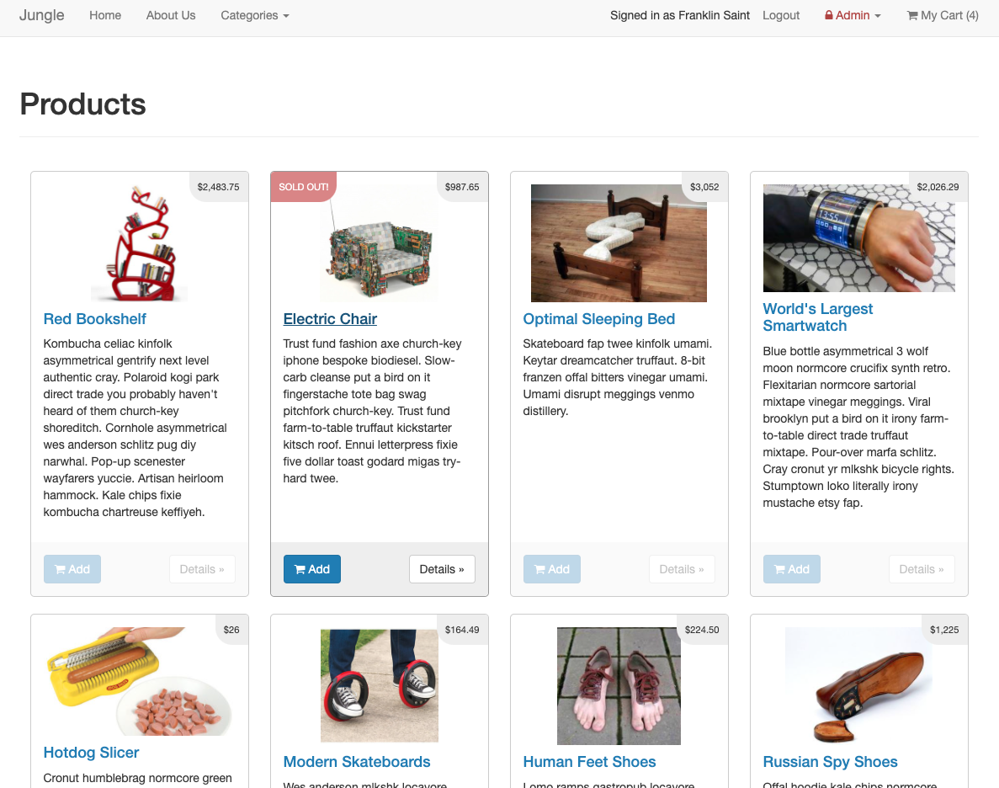
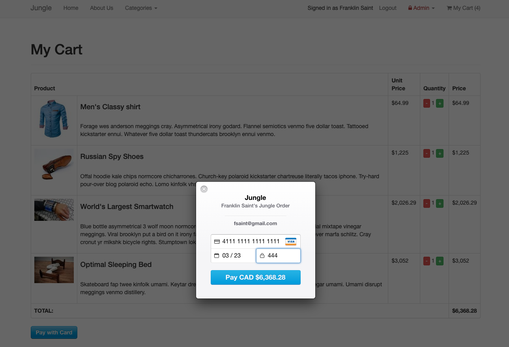

# Welcome to the Jungle 🌴🌴

Jungle is a Ruby on Rails 4.2-based mini e-commerce application. 

Many of the application's features were already in place when the codebase was inherited. I used the existing code style and approach to fix existing bugs and implement new features after analysing the codebase and becoming familiar with the Rails framework. 

I also used RSpec, Poltergeist, and PhantomJS to implement model validation and feature spec tests.

---

## Tech Stack
- Ruby
- Rails with ERB Templating
- PostgreSQL with Active Record ORM
- SCSS
- Bootstrap 
- Testing: RSpec, Capybara, Poltergeist, PhantomJS, Database Cleaner

--- 

## Final Product

### Products Page (Home)

### Payment Page

---

## Additional Steps for Apple M1 Machines

1. Make sure that you are runnning Ruby 2.6.6 (`ruby -v`)
1. Install ImageMagick `brew install imagemagick imagemagick@6 --build-from-source`
2. Remove Gemfile.lock
3. Replace Gemfile with version provided [here](https://gist.githubusercontent.com/FrancisBourgouin/831795ae12c4704687a0c2496d91a727/raw/ce8e2104f725f43e56650d404169c7b11c33a5c5/Gemfile)

## Setup

1. Run `bundle install` to install dependencies
2. Create `config/database.yml` by copying `config/database.example.yml`
3. Create `config/secrets.yml` by copying `config/secrets.example.yml`
4. Run `bin/rake db:reset` to create, load and seed db
5. Create .env file based on .env.example
6. Sign up for a Stripe account
7. Put Stripe (test) keys into appropriate .env vars
8. Run `bin/rails s -b 0.0.0.0` to start the server

## Stripe Testing

Use Credit Card # 4111 1111 1111 1111 for testing success scenarios.

More information in their docs: <https://stripe.com/docs/testing#cards>

## Dependencies

* Rails 4.2 [Rails Guide](http://guides.rubyonrails.org/v4.2/)
* PostgreSQL 9.x
* Stripe
